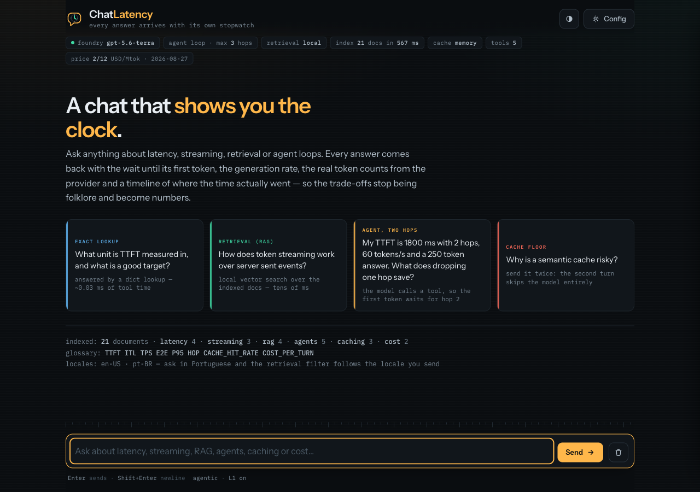
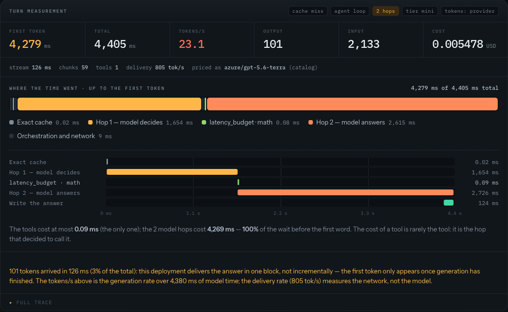
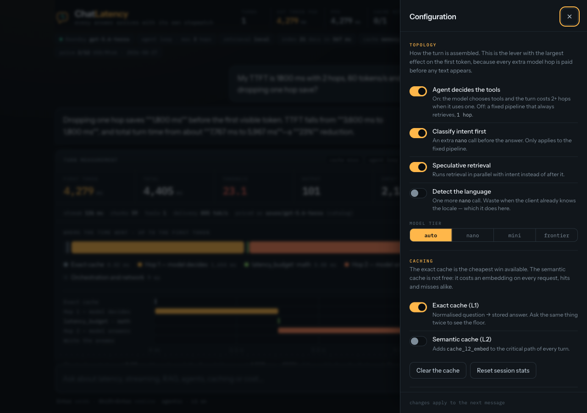

<div align="center">


# ChatLatency

**A chat that shows you the clock.**

Every answer arrives with the wait until its first token, the generation rate, the real token
counts from the provider, and a timeline of where the time actually went.

*A case study for anyone trying to understand latency and streaming in AI conversations.*

</div>

<p align="center">
  
</p>

---

## Why this exists

"Our assistant feels slow" is where most AI latency work starts, and it usually ends in
folklore: someone blames the model, someone blames retrieval, someone adds a cache, and
nobody measures. Meanwhile the advice circulating in blog posts and architecture diagrams —
*always stream*, *add a three-layer cache*, *let the agent decide* — is repeated far more
often than it is checked.

This repository is a working chat application built to check it. It is a deliberately simple
RAG agent (LangGraph + FastAPI + Server-Sent Events) instrumented span by span, where **every
latency lever is a switch you can flip per request** and watch the number move.

The one question it answers:

> Of the seconds a user waits before the first word appears, how much is the model, how much
> is retrieval, how much is your own orchestration — and how much of it is avoidable?

The agent is the instrument, not the product. Ask it about latency, streaming, RAG or agent
loops: it answers from an indexed corpus about exactly those topics, so the subject of the
conversation is the thing you are measuring.

**Sixteen things it found by measuring** are written up in **[docs/FINDINGS.md](docs/FINDINGS.md)**.
Three of them are worth putting on the front page:

- **The tool is never the cost — the hop is.** A tool that took 0.06 ms sat inside a turn that
  took 3,797 ms. The model call that *decided* to use it took 2,246 ms.
- **A deployment can use the streaming protocol and stream nothing.** Measured at the raw byte
  level: 6.2 seconds of silence, then the whole answer in bursts. That is where "our agent
  takes 8 seconds" comes from, and it is not the model being slow.
- **A semantic cache has no safe threshold.** "How do I enable a webhook" and "how do I
  disable a webhook" score 0.79 similarity. A legitimate paraphrase scored 0.48. The ranges
  are inverted, so no cut-off is safe.

---

## Run it

```bash
uv sync
cp .env.example .env      # pick a provider and fill in the credentials
uv run uvicorn app.main:app --reload --port 8000
# open http://localhost:8000
```

No API key handy? The engine ships a mock provider that simulates a realistic TTFT and token
rate, which is also how you verify the instrumentation itself:

```bash
LLM_PROVIDER=mock uv run uvicorn app.main:app --port 8000
```

| `LLM_PROVIDER` | use |
|---|---|
| `foundry` | Azure AI Foundry / AI Services, v1 API (`services.ai.azure.com`) |
| `azure` | classic Azure OpenAI (`<resource>.openai.azure.com` + `api-version`) |
| `openai` | OpenAI directly |
| `mock` | **simulates TTFT and token rate** — measures the engine's own overhead |

| endpoint | what it is |
|---|---|
| `/` | the ChatLatency UI |
| `/healthz` | effective configuration: provider, model, resolved price, levers, index |
| `/v1/corpus` | what is indexed, so you know which questions can be grounded |
| `/v1/traces/summary` | per-stage percentiles across this process's turns |
| `/docs` | OpenAPI |

Optional, and recommended before trusting any cache number:

```bash
docker compose up -d redis     # then in .env: REDIS_URL=redis://localhost:6379
```

---

## What you are looking at

Every assistant turn produces one **measurement card**. This is the whole point of the
project, so it is worth reading slowly.

<p align="center">
  
</p>

**1. The stopwatch.** While you wait, a chronograph counts up. It stops the instant the first
token arrives and turns green — that frozen number is time to first token, measured in the
browser, which is the only place the user's experience actually happens.

**2. The readouts.** First token, total time, generation rate, input and output tokens, and
cost. The token counts come from the provider's `usage` record, never from a character
estimate, and the cost is resolved per model from a versioned price catalogue.

**3. Where the time went.** A stacked bar of the critical path up to the first token. Two
things a naive sum of spans gets wrong, which this bar gets right: nested spans are not
double counted, and parallel spans are merged into one block that costs as much as its
slowest member. What is left between blocks is real orchestration overhead.

**4. The waterfall.** Every span placed in absolute time, so tools that ran concurrently
appear overlapping instead of stacked. The colours carry the argument: **warm is a model hop,
cool is a tool.** After two or three turns you stop reading the numbers and just see it.

**5. The reading.** One sentence that does the division for you — how much of the wait was
model hops, and how much was everything else.

The **Config** button opens the levers. Flip one, ask the same question again, and watch the
timeline change shape:

<p align="center">
  
</p>

The conversation lives in the browser tab and nowhere else. Nothing is persisted, no database,
no session store — closing the tab is the delete button.

---

## Four experiments, in about ten minutes

The UI is seeded with four questions, one per latency path. Run them in order and the
findings reproduce themselves.

### 1. The floor: ask the same thing twice

Ask anything, then ask it again, character for character. The second turn skips the model
entirely and comes back in tens of **microseconds** instead of seconds — three to four orders
of magnitude, the largest single latency improvement most conversational systems can make.
Turn *Exact cache (L1)* off in Config and it goes back to being slow.

What you are seeing: an exact cache over a normalised key. Cheap, safe, and almost always
under-used. Note the readout says `cost 0 — cache`: it also spent no tokens.

### 2. The hop: ask something that needs a tool

Ask *"what unit is TTFT measured in?"*. The model calls `metric_lookup`, an in-memory dict
lookup that takes about **0.03 ms**, and the turn takes **three to four seconds**. Look at the
waterfall: two warm bars (hop 1 decides, hop 2 answers) with a sliver of colour between them
that is the tool.

That sliver is the lesson. Optimising the tool would optimise 0.002% of the turn. The lever is
the number of hops, not the speed of the tool.

### 3. The topology: turn the agent off

In Config, switch off *Agent decides the tools*. The turn now runs a fixed pipeline: retrieve
first, then answer, one model call. Ask the same question again.

The first token arrives sooner, because the model no longer spends a full round trip deciding
what to do. That is the trade: the agent loop buys flexibility with a round trip that is paid
before the user sees anything. Measured across 14 requests, the difference was **+747 ms at
p50** — and it is the same structural cost as an intent classifier, wearing a different name.

### 4. The lie: check whether you are actually streaming

Watch the `stream` figure in the strip below the readouts, and compare it with the total. If
100 tokens arrived inside 3% of the total time, your deployment generated the whole answer
and delivered it in one block. The protocol was streaming; the experience was not.

ChatLatency detects this by itself and says so in plain language. If you see that warning,
every "we stream, so it feels fast" claim in your architecture is currently false.

To check a deployment before wiring it up, skip the UI and read the socket directly:

```bash
PYTHONPATH=. uv run python scripts/probe_streaming.py gpt-4.1-mini gpt-5.4 gpt-5.6-terra
```

On the resource these findings came from, that probe separated five deployments that stream
from one that does not - and the one that does not was the newest model, at the lowest TPM.
See [finding 10](docs/FINDINGS.md).

---

## The concepts, briefly

The same corpus the assistant retrieves from — 21 documents plus a glossary, in
`data/corpus.json` — so you can ask it any of this and check the answer against the source.

**Time to first token (TTFT)** is when the answer starts. In a streaming interface it is the
number the user judges, because everything before the model call — auth, intent
classification, retrieval, cache lookups, network hops — is paid in full before a single
character appears. Under 1,000 ms feels responsive; under 300 ms feels instant.

**Inter-token latency** is the gap between tokens once generation starts, and **tokens per
second** is the rate. Here is the counter-intuitive part: an adult reads at roughly 6 tokens
per second, so a model producing 60 is already producing text faster than anyone can consume
it. Two hundred milliseconds shaved off the first token is worth more than doubling the
generation rate.

**Streaming** turns one long response into a sequence of small events over a long-lived HTTP
response. Total generation time is unchanged; the user simply starts reading after the first
delta instead of the last one. It only works if nothing between the model and the browser
buffers the body — proxies, compression middleware and low-capacity deployments all do.

**Retrieval augmented generation (RAG)** answers in two steps: find passages that probably
contain the answer, then ask the model to answer using only those. It adds latency, but it
adds *input tokens* faster than it adds milliseconds — the passages are usually far larger
than the answer. Retrieving less and better beats retrieving more. And an exact attribute — a
unit, a threshold, a limit — belongs in a lookup table, not a vector index: a dict cannot
return an approximately correct number.

**An AI agent** is a loop. The model receives the conversation plus a list of tools and either
answers or asks for a tool; the runtime runs the tool, appends the result, and calls the model
again. What makes it powerful is that routing is decided at request time rather than design
time. What makes it expensive is exactly the same thing: the decision itself is a full model
call, paid before any text is visible.

**Caching** has two very different tiers. An exact cache maps a normalised question to a
stored answer and is close to free. A semantic cache reuses the answer to a *similar*
question, which costs an embedding on the hot path on every request — including the misses —
and carries a correctness problem that has no clean solution (see finding 06).

**Cost** must come from the provider's usage record, per hop, summed across the turn. Two
traps recur: an agent turn produces one usage record per hop and costs their sum, and a tool
that calls a model internally burns tokens that never appear in the calling turn's usage at
all.

---

## How it works

```
app/
  config.py     levers and providers - everything affecting latency is explicit
  telemetry.py  Trace with spans mapped 1:1 onto the reference budget
  llm.py        nano/mini/frontier tiers, parameter shim, real usage and cost
  cache.py      exact L1 + semantic L2, Redis or in-process fallback (flagged)
  retrieval.py  structured lookup + hybrid BM25 index + Azure AI Search
  tools.py      six tools, each individually timed; ChromaDB and the internet
  graph.py      the LangGraph graph: agent loop and fixed pipeline, comparable
  pricing.py    price PER MODEL: catalogue, override, and the number's provenance
  main.py       SSE endpoints and harness operations
static/
  index.html    the ChatLatency UI - one file, no build step, no dependencies
bench/
  workload.py   traffic mix, with a realistic concentration of topics
  load.py       load driver, per-stage percentiles, comparison against the budget
tests/
  test_pricing.py          what must hold about price regardless of the catalogue
  test_stagehand_shape.py  pins the Stagehand contract without needing a key
scripts/
  probe_streaming.py  reads raw bytes to tell whether a deployment really streams
  calibrate_l2.py  measures whether a safe semantic-cache threshold exists
  browse_once.py   runs web_browse and shows the cost of each sub-step
  fetch_prices.py  downloads the public price table -> data/model_prices.csv
data/
  corpus.json       the indexed documents and the metric glossary (synthetic)
  model_prices.csv  price per model, versioned (see app/pricing.py)
docs/FINDINGS.md    the sixteen findings, in full, with the numbers
```

### The two topologies

```
agentic (default) — the model picks the tools
  cache ─miss─ agent ──tool_calls──▶ tools ──┐
                 │                            │  (loop, up to MAX_TOOL_HOPS)
                 │◀───────────────────────────┘
                 └── text ──▶ streamed to the user

fixed — a deterministic pipeline, no tool decision
  cache ─miss─ [locale] ─┬─ intent ──┐
                         └─ retrieval┴─ route ─ generate
```

Both live in the same process on purpose. Comparing them is the most useful measurement here:
the fixed pipeline makes **one** round trip to the model, the agent loop makes at least
**two** whenever it uses a tool, and the whole difference lands on the first word.

### The six tools, chosen for their latency profiles

| tool | what it does | where it runs | latency |
|---|---|---|---|
| `metric_lookup` | an exact attribute of a metric | in-memory dict | **0.03–0.08 ms** |
| `latency_budget` | turns TTFT / rate / hops into a felt experience | pure arithmetic | **~0.01 ms** |
| `kb_search` | RAG over the indexed docs | **ChromaDB + in-process ONNX** | **23–45 ms** |
| `web_search` | internet search | **Browserbase Search** | **283–324 ms** |
| `web_fetch` | reads a URL as markdown | **Browserbase Fetch** | **430–730 ms** |
| `web_browse` | a real browser, with JavaScript | **Stagehand** — opt-in | **12.3 s** |

Six orders of magnitude between the fastest and the slowest. That spread is the point: it is
what makes the waterfall teach something. Tools requested in the same hop run **concurrently**,
so the step costs the slowest one rather than the sum — and the waterfall shows the overlap.

`web_browse` is the only tool that opens a browser session, and it is off at three levels: out
of `ENABLED_TOOLS`, behind `ENABLE_WEB_BROWSE=false`, and with the package as an optional
dependency (`uv sync --extra browse`). Without a `BROWSERBASE_API_KEY` the search backend
falls back to DuckDuckGo so the repo runs out of the box, and the trace records the
**effective** backend — a number measured with one backend cannot be read as another's.

### Levers

All of them live in `.env` and **can be overridden per request** in the POST body, which is
what allows an A/B inside one process without a restart.

| variable | effect |
|---|---|
| `AGENTIC` | agent loop (the model picks tools) vs. fixed pipeline |
| `ENABLED_TOOLS` | which tools the model sees |
| `MAX_TOOL_HOPS` | ceiling on model round trips per turn |
| `SPECULATIVE_RETRIEVAL` | fan out intent ∥ retrieval vs. run them in sequence |
| `CLASSIFY_INTENT` | intent on or off the critical path |
| `DETECT_LOCALE` | LLM language detection |
| `CACHE_L1_ENABLED` / `CACHE_L2_ENABLED` | the cache tiers |
| `CACHE_L2_THRESHOLD` | minimum similarity for a semantic hit |
| `REASONING_EFFORT` | reasoning effort (gpt-5.x / o-series) |
| `force_tier` (per request only) | forces nano/mini/frontier, bypassing the router |
| `RETRIEVER` | `local` (real index) · `stub` (fixed latency) · `search` (Azure AI Search) |
| `WEB_SEARCH_BACKEND` | `browserbase` · `duckduckgo` (keyless) · `tavily` · `brave` · `serper` |
| `WEB_FETCH_MAX_CHARS` | cap on what Fetch returns to the model — a cost lever |
| `LLM_PROVIDER` | `foundry` · `azure` · `openai` · `mock` |

### Decisions worth recording

- **The generation node pushes chunks into an `asyncio.Queue` read by the SSE endpoint**,
  rather than using `astream_events`. In a latency instrument, no layer belongs between the
  socket and the stopwatch.
- **`max_retries=0` on the provider client.** Automatic retries mask real latency and turn an
  error into an unexplainable long tail.
- **Provider `usage`, never an estimate.** `stream_options={"include_usage": True}` brings
  input, output and **cached** token counts. The trace records the source (`usage_source`), so
  an estimated number never disguises itself as a measured one.
- **Two token rates, never mixed.** `tokens_per_s` is tokens over the model phase (always
  valid); `delivery_tokens_per_s` is tokens over the stream window (only valid if the provider
  emits incrementally), and `stream_buffered` flags when it does not.
- **Concurrent spans stay separate on purpose.** The sum of stages is *not* supposed to match
  the total when there is parallelism, and that difference is exactly the gain being measured.
- **`cache_backend` goes in every trace.** A number measured with an in-process `dict` cannot
  be read as a production number.
- **Price comes from a versioned catalogue, resolved per model**, with its provenance attached.
  A cost of `$0.004` with no way to tell whether it came from a table, a contract or a guess is
  not information.

---

## The bench

```bash
uv run python -m bench.load --scenario cold        --requests 30 --concurrency 5
uv run python -m bench.load --scenario ab-intent   --requests 20 --concurrency 4
uv run python -m bench.load --scenario ab-agentic  --requests 14 --concurrency 3
uv run python -m bench.load --scenario ab-spec     --requests 20 --concurrency 4
uv run python -m bench.load --scenario cache-curve --requests 30 --concurrency 5
uv run python -m bench.load --scenario tiers       --requests 16 --concurrency 4
uv run python -m bench.load --scenario mixed       --requests 60 --concurrency 10
```

| scenario | the question it answers |
|---|---|
| `cold` | what the first token is with a 100% cache miss |
| `ab-intent` | what intent classification costs on the critical path |
| `ab-agentic` | what it costs to let the model pick the tools |
| `ab-spec` | what speculative retrieval actually saves |
| `cache-curve` | latency per cache tier, hits and misses kept apart |
| `tiers` | TTFT per model tier |
| `mixed` | a realistic load with a traffic mix |

Each run writes a JSON file to `reports/`, with per-stage percentiles and the server's
effective configuration at the moment of measurement.

Other things worth running:

```bash
uv sync --extra dev && uv run pytest -q             # the price-catalogue test suite
uv run ruff check .                                  # lint
PYTHONPATH=. uv run python scripts/probe_streaming.py gpt-4.1-mini gpt-5.4  # does it really stream?
PYTHONPATH=. uv run python scripts/calibrate_l2.py   # is there a safe L2 threshold? (no)
PYTHONPATH=. uv run python scripts/browse_once.py    # where 12 seconds of browsing go
uv run python scripts/fetch_prices.py --check        # CI: fail if list prices moved
uv run python -m tests.test_stagehand_shape          # pins the Stagehand contract
```

---

## Honesty about the numbers

Every number in this repository was measured on a local machine in Brazil against
`api.openai.com` and Azure AI Foundry in eastus2, with samples of 8 to 40 requests per
scenario. They answer *where the time goes*. They do not answer *what it costs in your region
with provisioned throughput*, and they are not a substitute for measuring your own stack —
which is the entire point of shipping the instrument rather than just the conclusions.

The corpus in `data/corpus.json` is synthetic teaching material written for this project. The
full list of caveats — network route, missing API gateway, in-process cache, small samples,
list prices — is at the end of [docs/FINDINGS.md](docs/FINDINGS.md).

---

## License

MIT. See [LICENSE](LICENSE).
